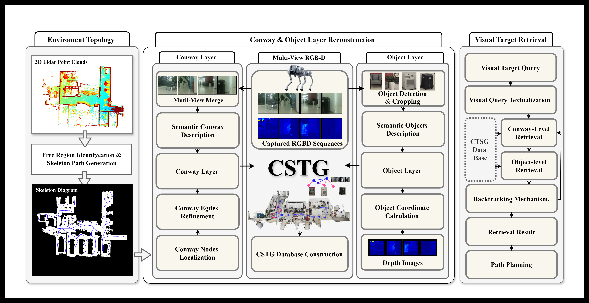

# CTSG: Context and Topology based Multi-Modal Scene Graph for Visual Target Navigation
This repository is the official implementation of the paper: CTSG: Context and Topology based Multi-Modal Scene Graph for Visual Target Navigation[🔗](http://)

> - [ ] **[L]** CTSG is a hierarchical 3D scene graph mapping method designed for visual object navigation. It features a dual-layer structure: an object layer and a novel *Conway* layer (short for *context* and *way* topology), composed of topological waypoints enriched with multi-modal context information.
>
> - [ ] **[3]** cases video--现实世界 最好的
>

## Abstract
For visual target navigation tasks, a suitable environment representation plays a vital part in robot system to complete the navigation tasks. 3D Scene Graphs serve as sparse representations that excel at representing environments efficiently compare to dense semantic maps. Typical Scene Graphs are generally constructed based on multi-level semantic labels with hierarchical structures, which may lead to the loss of valuable spatial information, such as spatial topological relations, common sense understanding and visual context information. In this work, we propose **CTSG**, a Hierarchical 3D scene graph mapping approach for visual object navigation. Our graph adopts a dual-layer structure. Besides object layer, a novel conway (short for context information and way topology) layer is introduced, which consists of topological waypoints with rich multi-modal context information. We demonstrate the effectiveness of our method in novel visual target navigation tasks through simulation and real-world experiments across varied environments and instructions.

## Video
<video controls>
  <source src="./CSTG_Final.mp4" type="video/mp4">
  Your browser does not support the video tag.
</video>

## Approach

> 描述-优势

### Scene Graph Construction

> 描述---换成gif

> 描述

### Visual Target Navigation with Scene Graph

> **[M]**整体架构图+retrieval details描述

## Experiment

### Instance Segmentation Model Selection

We evaluate our instance segmentation on the Replica dataset, following the same evaluation protocol as described in Conceptgraph. The segmentation performance of current models is compared using two metrics: Mean Accuracy (mAcc) and Frequency-weighted Intersection over Union (F-mIoU).

> Segmentation Model Selection 表

we report various semantic segmentation results on Replica dataset. The combination of the RAM and SAM series demonstrates a significant advantage over MaskCLIP and Mask2former. Although its performance metrics are slightly lower than those of fine-tuned models, the open-vocabulary segmentation model demonstrates a clear advantage in scene transferability. There is no significant performance difference between the SAM and SAM2 models, but SAM is more widely-used and adaptable to other models. Therefore, we selected the RAM+SAM combination for object segmentation in scenes.

### 1. Graph

obj location acc: 对比ConceptGraph，hovsg?在gt环境下评测
[parameter_list](#section-heading)

### 1. Dataset

1. scene data

   HM3D

   （Matterport 3D）

2. task data

   HM3D

### 2. Scene Graph 

#### HM3D+Matterport3D评测表格

> HM3D and  Matterport3D 评测表格
##### HM3D
| Scenes | GON/SON | Accuracy(%) | Position Error(m) |
|:--------:|:---------:|:-------------:|:-------------------:|
|BAbdmeyTvMZ | 63/370 | 57.14 | 0.2682 |
|Dd4bFSTQ8gi | 344 / 392 | 53.49 |  0.2319 |
|QaLdnwvtxbs& | 238 / 238| 42.72 | 0.2964 |
|svBbv1Pavdk | 286 / 372 | 47.20 | 0.4720 |
| mean        |           | 50.14 | 0.3171|

#### Matterport3D
| Scenes | GON/SON | Accuracy(%) | Position Error(m) |
|:--------:|:---------:|:-------------:|:-------------------:|
|2azQ1b91cZZ | 695 / 862 | 44.75 | 0.3096 |
|EU6Fwq7SyZv | 295/438 | 52.63 | 0.3228 |
|oLBMNvg9in8 | 483/770 | 52.59 | 0.2554 |
|TbHJrupSAjP | 421/641 | 60.57 | 0.2833 |
|x8F5xyUWy9e | 93/276 | 41.92 | 0.2725 |
|Z6MFQCViBuw | 152/562 | 58.55 | 0.3184 | 
| mean        |           | 52.91 | 0.2956|
 

The accuracy of the constructed scene graph is evaluated on the Matterport3D and HM3D datasets. GON represents the number of predicted objects in the scene graph, SON represents the number of objects in the real scene, and Accuracy indicates the percentage of correctly predicted objects in the scene graph. The evaluation details are as follows: the object categories and object coordinates in the scene graph are matched with the ground truth categories and coordinates. An object prediction in the scene graph is considered correct only if the category labels match and the distance between the object coordinates in the scene graph and the ground truth coordinates is less than a threshold (1 meter). Position Error represents the average distance error between the correctly predicted objects in the scene graph and the ground truth objects.

To further demonstrate the accuracy of our proposed CSTG in constructing scene graphs, we include a comparative experiment with ConceptGraph. The experimental results are presented in the table.

> conceptgraph 和 ours 在HM3D数据集上测评表

obj location acc: 对比ConceptGraph，hovsg?在gt环境下评测 

1. gt从habitat-sim如何获取
2. 如何对比（和competetive的xx方法对比）
3. 结果：

| dataset | scene | ConceptGraph | ours |
| ----------- | ----- | ------------ | ---- |
|      _       |       |              |      |
|       _      |       |              |      |

分析：

描述：为什么做，怎么做，结果如何，代表xx

### 3. Visual Target Navigation

1. Navigation Evaluation

   conway整体方法（包括构图、检索）有效性

   ​	1. with/without：在原本的基础上去掉conway检索=只对所有object列表做clip+vlm

   > 2. room cluster：在原本的基础上把conway换成room（聚类得到，有图文），其他不变

2. Retrieval Evaluation

   去掉VLM不确定因素

   1. Top K Accuracy

      为了找到最好的K

      去掉VLM不确定因素，探讨clip结果的precision

      选出最合适的K

      👇

      | layer/Top K acc | K=1  | K=3  | K=5  |
      | --------------- | ---- | ---- | ---- |
      | conway          |      |      |      |
      | object          |      |      |      |

      > 或者
      >
      > 加上vlm，评测两个内容：1. clip选择的结果，2. VLM对不同K的表现

   2. conway  & room？多模态or单模态？
      
      单模态多模态

      1. 去掉vlm的我们的方法，纯评估graph：

         clip conway top 3 --> expand to 9 --> clip obj top 1、
         
      2.去掉文本模态：

         clip conway top 3 --> expand to 9 --> clip obj（only image） top 1

      3. 去掉图像模态：

         clip conway top 3 --> expand to 9 --> clip obj（only text） top 1
      
      4. conway 换成gt room

         clip room label top 3 --> clip obj top 1

      | scanes name | sr(top1) | sr(top3) | sr(top5) |
      |:-----------:|:--------:|:--------:|:--------:|
      |BAbdmeyTvMZ  |  9.09    |     24.24      |24.24    |
      |Dd4bFSTQ8gi  | 9.33     |    14.67       |16        |
      |mv2HUxq3B53  | 16       |     18.67      |25.33     |
      |Nfvxx8J5NCo  | 0        |      0     |5.13      |
      |QaLdnwvtxbs  |18.52     |      44.44     |51.85     |
      |svBbv1Pavdk  | 0        |      1.75     |3.51      |
      |VBzV5z6i1WS  |7.29      |       15.63    |23.96    |
      |ziup5kvtCCR  | 0        |       0      |2.56     |
      | mean        | 7.53     |        14.925     |19.07     |  

      5. 去掉文本模态（论文baseline）

      | scanes name | sr(top1) | sr(top3) | sr(top5) |
      |:-----------:|:--------:|:--------:|:--------:|
      |BAbdmeyTvMZ  |  9.09    |     24.24     |30.3     |
      |Dd4bFSTQ8gi  | 6.67     |    12      |14.67     |
      |mv2HUxq3B53  | 0        |    2.67      |8         |
      |Nfvxx8J5NCo  | 2.56     |      7.69    |7.69      |
      |QaLdnwvtxbs  |7.41      |     33.33     |48.14     |
      |svBbv1Pavdk  | 0        |      17.54    |3.51      |
      |VBzV5z6i1WS  |8.33      |      19.79    | 26.04    |
      |ziup5kvtCCR  | 0        |       0   | 0        |
      | mean        |4.26      |       14.28   | 17.29    |

      6. 去掉图像模态（论文baseline）

       | scanes name | sr(top1)|  sr(top3)    | sr(top5)|
      |:-----------:|:--------:|:--------:|:--------:|
      |BAbdmeyTvMZ  |  0       |    21.21      |24.24    |
      |Dd4bFSTQ8gi  | 4        |     10.67     |12        |
      |mv2HUxq3B53  | 16       |     22.67     |26.67     |
      |Nfvxx8J5NCo  | 5.12     |   7.69       |7.69      |
      |QaLdnwvtxbs  |0         |    15.82      |25.93     |
      |svBbv1Pavdk  | 3.51     |      5.26    |5.26      |
      |VBzV5z6i1WS  |6.15      |     16.66     |18.75    |
      |ziup5kvtCCR  | 0        |     0     | 2.56     |
      |mean         | 4.35     |     13.00     | 15.38  |
         clip room label top 3 --> clip obj（only text） top 1
3. 多任务task

      

## 参数表

| Subsystem | Hyperparameters | Value |
| --------- | --------------- | ----- |
|     _      |                 |       |
|    _       |                 |       |
|       _    |                 |       |

